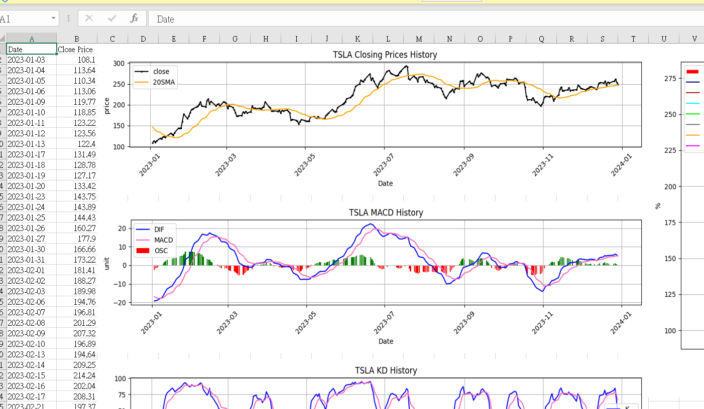
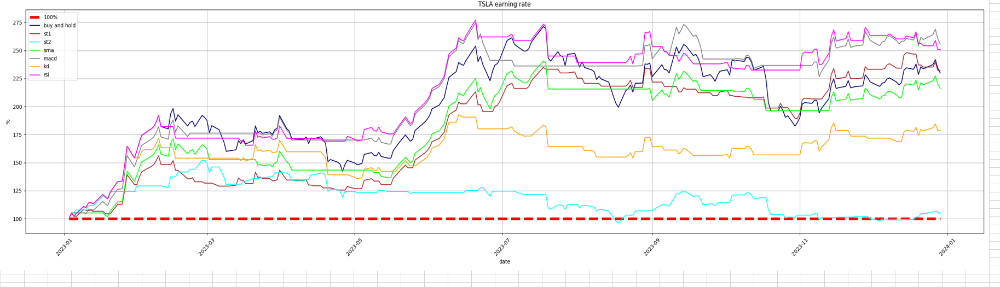

# Evaluating Your Stock Buying Strategy in a Scientific and Objective Way

This python tool allows you to analyze different stock buying strategies and visualize their outcomes. Key features include:

1.You will be able to see the peformance of different strategies such as macd, rsi, and kd

2.You can choose any stock and any time you want to analysis.

3.The final outcomes will be compiled into an excel file

# Outcome Preview

# Technical Indicator Parameters

1.SMA (Simple Moving Average): 20-day period.

2.MACD (Moving Average Convergence Divergence): Fast period = 12, Slow period = 26, Signal period = 9.

3.KD (Stochastic Oscillator): Fast %K = 9, Slow %K = 5, Slow %D = 5, using simple moving averages.

4.RSI (Relative Strength Index): Fast period = 5 days, Slow period = 10 days.

# illustration of different strategy

1.Buy and Hold: Buy at the start of the period and sell at the end.

2.St1: Buy when the price rises, sell when the price falls.

3.St2: Buy when the price falls, sell when the price rises.

4.SMA: Buy when the closing price is higher than the SMA, and vice versa.

5.MACD: Buy when the MACD Oscillator (OSC) is positive, and vice versa.

6.KD: Buy when %K is higher than %D, and vice versa.

7.RSI: Buy when RSI(5) is higher than RSI(10), and vice versa.

warning: trading tax has not been consider

# input

You can set three parameters to customize your analysis:

1.Stocks: Choose the stocks you want to analyze by providing them in an array.

2.Starting Time: Set the starting date for your analysis.

3.End Time: Set the end date for your analysis

The following is an example

stocks = ['^GSPC','AAPL','TSLA']
start = '2023-01-01'
end = '2024-01-01'
